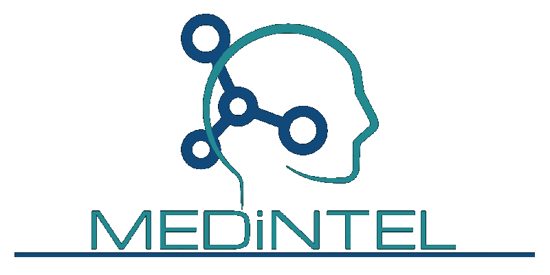

#  MEDiNTEL

> A Smarter way to understand your blood.

## What is it?
MEDiNTEL is a software that translate your blood in a different way.
MEDiNTEL collects data from your blood count and translates in a simple language for you understanding besides analyze your chances of getting a new disease.

## Why did it arise?
Because of the problems arising from doctor-patient communication that are often lacking: *Time, agility and clarity*
MEDiNTEL has emerged.

## Proposal
MEDiNTEL offers some solutions to the problems already mentioned:

+ Faster
+ More Agile
+ More Communicative
+ All the time with you

## And how does it work?
*Simple!*
With the entire Database and Useful Information on the Patient's Blood Count we can analyze and do the magic. Making sure that when the patient's doctor inserts the blood count into the system, everything works autonomously and almost instantly, thus generating for both doctor and patient, the result of the exam formatted on a simple way that both can understand. Then a copy is saved in the database allowing the patient and the pacient's doctor to see it later.

## Highlights

---

Building......

## Version

**0.0.0**
